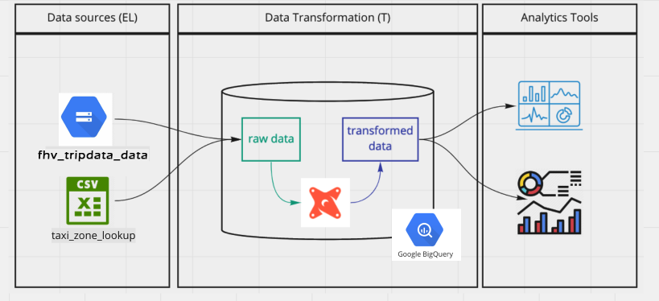

Welcome to your new dbt project!

### How to run this project 
### About the project
This project is based in [dbt starter project](https://github.com/dbt-labs/dbt-starter-project) (generated by running `dbt init`)
Try running the following commands:
- dbt run
- dbt test

#### Workflow

### dbt resources:
- Learn more about dbt [in the docs](https://docs.getdbt.com/docs/introduction)
- Check out [Discourse](https://discourse.getdbt.com/) for commonly asked questions and answers
- Join the [chat](http://slack.getdbt.com/) on Slack for live discussions and support
- Find [dbt events](https://events.getdbt.com) near you
- Check out [the blog](https://blog.getdbt.com/) for the latest news on dbt's development and best practices
